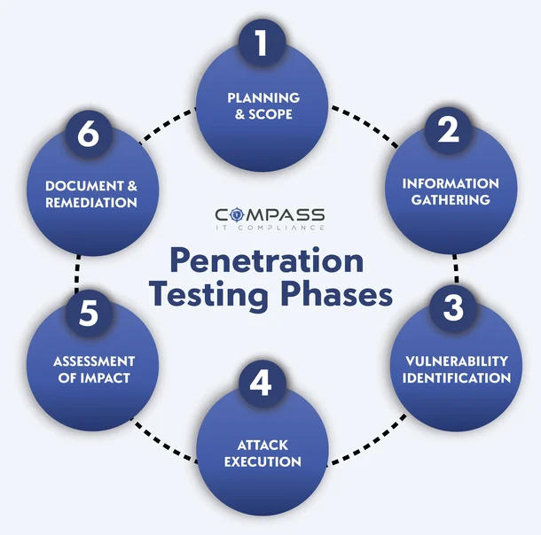

# BELAJAR HACKING / CYBER SECURITY

Repositore ini berisi jalur pembelajaran dan catatan saya untuk cyber security dan penetration testing. Diorganisir berdasarkan level mulai dari fundamentals hingga advanced.

## 🗺️ Cyber Security Learning Roadmap

### [Level 1 — Fundamental (Wajib Kuasai Dulu)](./Level1-Fundamental/)
✅ 1. Linux & Command Line (lu udah kuat, mantap)
- Permission
- Cron job
- systemctl
- File system
- Install service

✅ 2. Networking (lu juga sudah kuat)
- TCP/IP, UDP
- DNS, HTTP, HTTPS
- Port scanning
- Firewall (Lu udah pakai Fortigate & Sophos — advantage besar)

📌 3. Basic Scripting
- Bash
- Python dasar
- Simple automation (scan, brute, etc)

### [Level 2 — Tools Pentesting Wajib Pahami](./Level2-Tools-Pentesting/)
📍 4. Nmap
- Host discovery
- Service & version detection
- Vulnerability scripts --script vuln

📍 5. Burp Suite
- Proxy
- Repeater
- Intruder
- Decoder
- Basic automation

📍 6. OWASP ZAP (alternatif Burp)

### [Level 3 — Web Hacking (Mulai dari DVWA)](./Level3-Web-Hacking/)
Gunakan DVWA yang barusan lu install

**DVWA urutan belajarnya:**
- Command Injection
- SQL Injection
- XSS (Reflected & Stored)
- File Upload
- File Inclusion (LFI/RFI)
- Brute Force
- CSRF
- Weak Session/Security Misconfig

**Cara belajar DVWA:**
- Set security = Low
- Coba semua vulnerability
- Pindah ke Medium
- Terakhir High

### [Level 4 — OWASP Top 10 (Wajib Kuasai)](./Level4-OWASP-Top10/)
- Broken Access Control
- Cryptographic Failures
- Injection
- Insecure Design
- Security Misconfiguration
- Vulnerable & Outdated Components
- Identification & Authentication Failure
- Software & Data Integrity Failure
- Security Logging & Monitoring Failure
- SSRF

### [Level 5 — Real Exploitation (After DVWA)](./Level5-Real-Exploitation/)
Setelah DVWA lancar → lanjut:

🧪 1. bWAPP (lebih lengkap)  
🧪 2. Juice Shop (lebih modern)  
🧪 3. WebGoat (by OWASP)  
🧪 4. TRYHACKME + HACKTHEBOX  
   - Beginner path  
   - Web pentesting path  
   - Privilege escalation path  

### [Level 6 — Bug Bounty Starter](./Level6-Bug-Bounty-Starter/)
Kalau lu mau serius:
- SQLi
- XSS (stored/reflected/dom)
- IDOR (Broken Access Control) — paling sering $$$
- SSRF
- RCE
- Open Redirect
- Authentication bypass
- Rate limit bypass

### [Level 7 — DevSecOps & Defense (optional)](./Level7-DevSecOps/)
- WAF (lu udah pernah)
- SIEM (lu udah pake Wazuh)
- Hardening
- Logging
- Zero-trust network
- Container security (Docker)

## 🔥 Paket Urutan yang paling efektif buat lu mulai SEKARANG

| Waktu | Fokus |
|-------|--------|
| 🟩 Minggu 1 | Nmap + Burp Suite Basic |
| 🟩 Minggu 2 | Belajar DVWA |
| 🟩 Minggu 3 | bWAPP + Juice Shop |
| 🟩 Minggu 4 | TryHackMe Web Fundamentals |
| 🟩 Bulan 2 | OSWE-style (web exploit deeper) |
| 🟩 Bulan 3 | Bug bounty real world |
